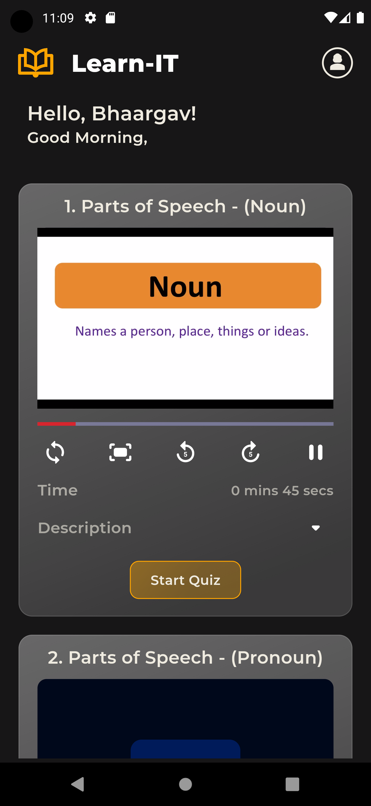
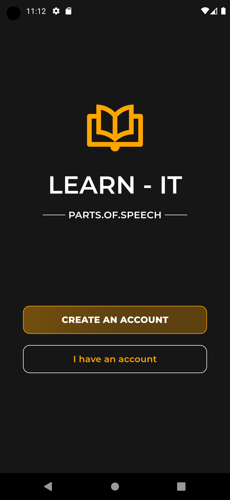
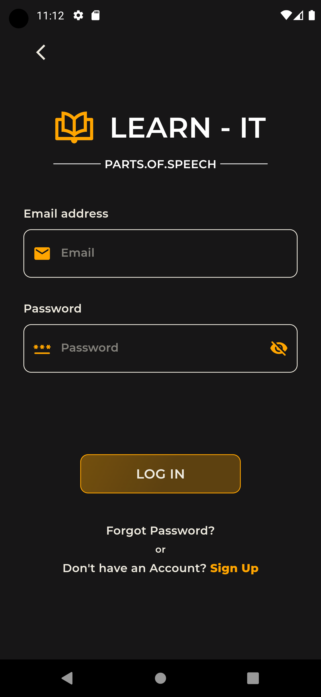
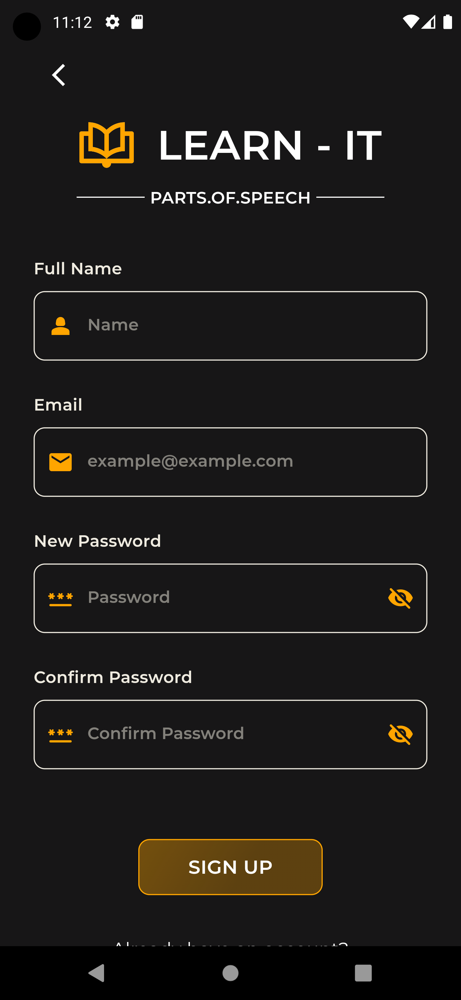
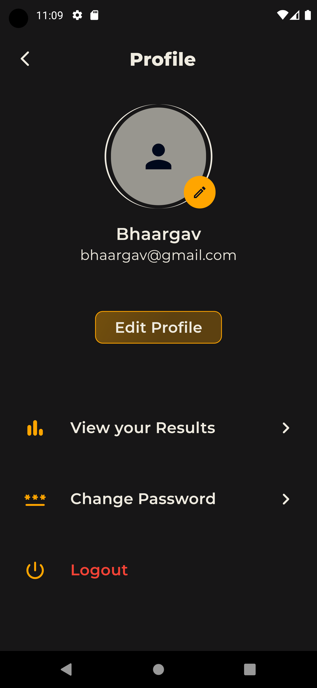
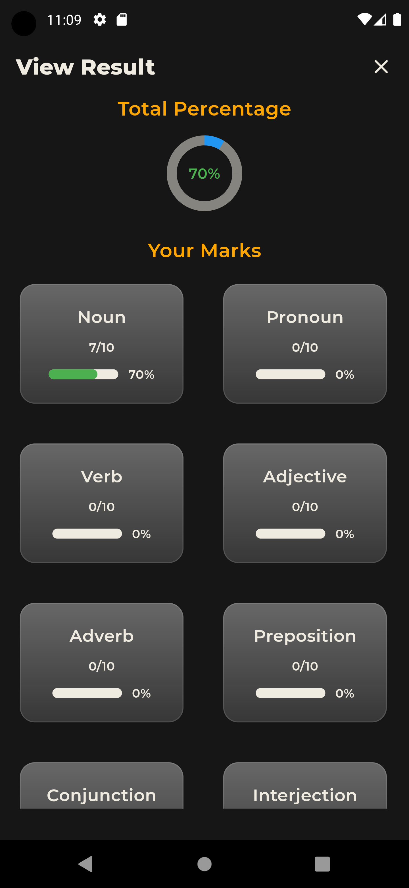
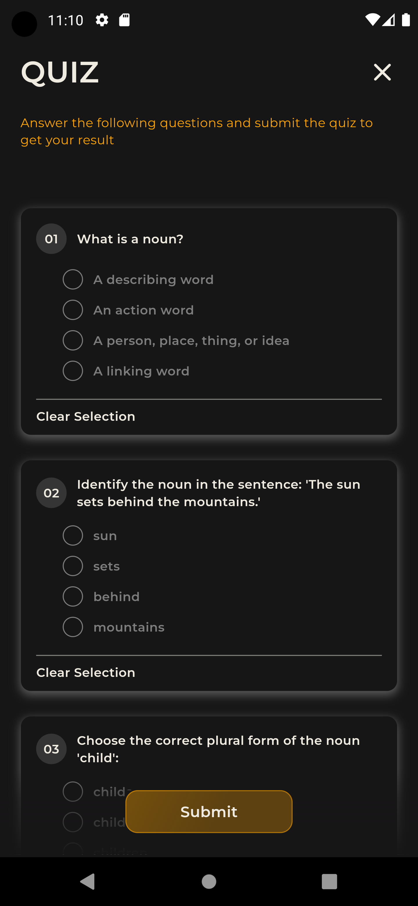
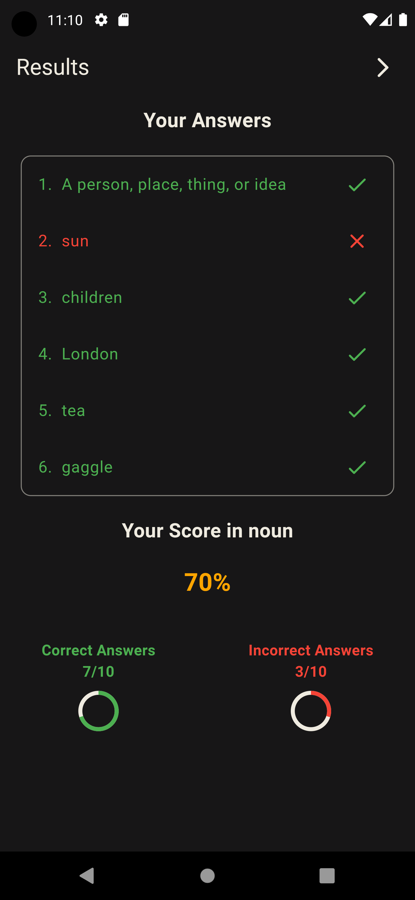

# ⭐ LearnIT
* The first step to learn English is to start learning with the basics which is the `8 Parts of Speech`, The 8 Parts of Speech includes:
    * Noun
    * Pronoun
    * Verb
    * Adjective
    * Adverb
    * Preposition
    * Conjunction
    * Interjection
* LearnIT is the App to learn the 8 Parts of Speech which is the basic with a video and a quiz after the video to learn them quickly and efficiently.
* LearnIT is developed using `Flutter` as Frontend and `Firebase` as the Backend of the application.

  
# ⭐ Run the App in your Machine
* You must have `Visual Studio Code` or `Android Studio` in your Machine
* You must have installed `Flutter` in the above platforms
* Clone the project from Github using the link `https://github.com/BhaargavGuptaP/learnit.git` or download the project from my Repository
* Run the `pubspec.yaml` file to load the flutter packages
* Open the Emulator and run the Project

# ⭐ ScreenShots of LearnIT App
  

     

        <h2><b>Main Page</b></h2>  
        
     

     

        <h2><b>Landing Page</b></h2>  
         
     

     

        <h2><b>LogIn Page</b> </h2> 
        
     

  

    
  

     <h2><b>SignUp Page</b></h2>  
      
  

  

     <h2><b>Profile Page</b></h2>  
     
  

  

     <h2><b>All Result Page</b></h2>  
     
  

    
  

     <h2><b>Quiz Page</b></h2>  
     
  

  

     <h2><b>Quiz Result Page</b></h2>  
      
  

